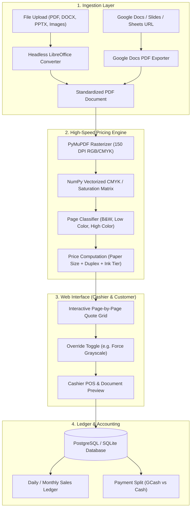
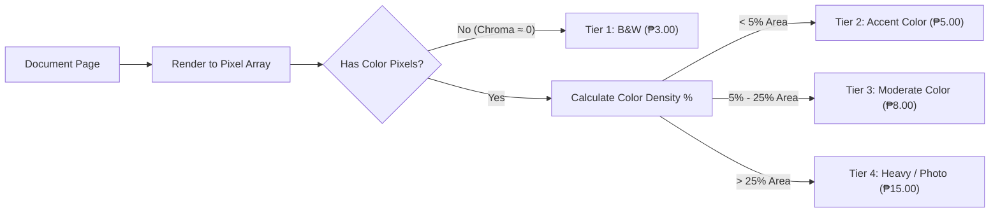
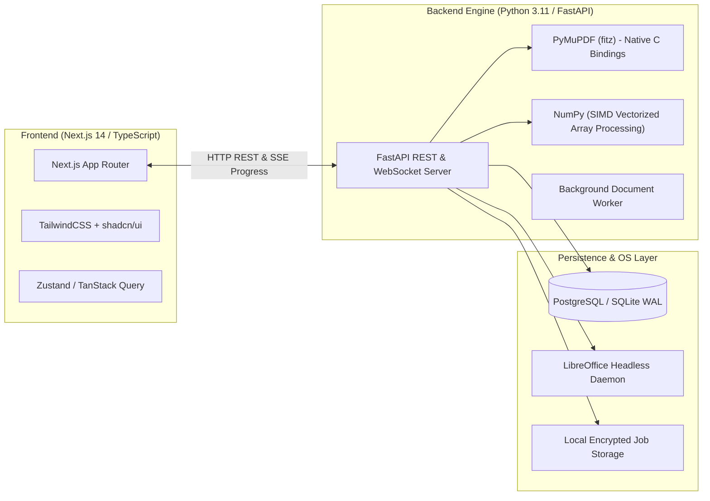
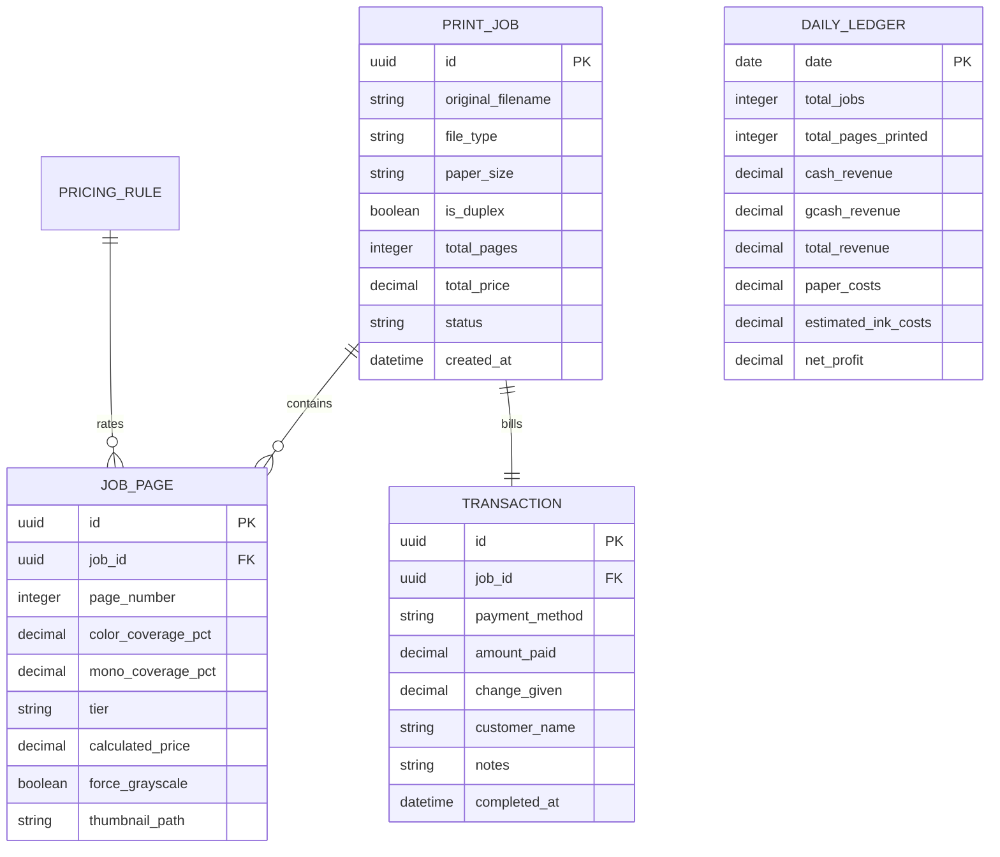
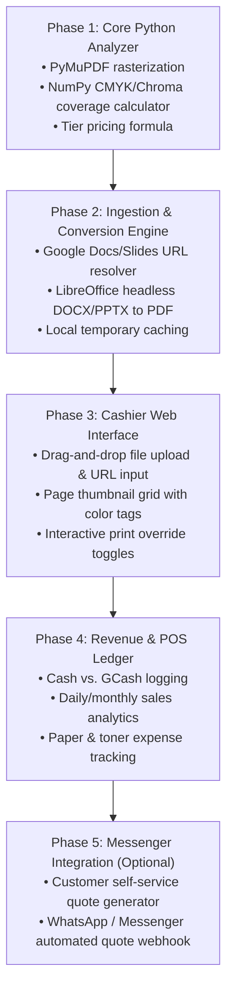

# Sari-Sari Store Smart Print & Revenue Management System
## Architectural Blueprint & Technical Implementation Plan

---

### 1. Executive Summary & Vision

Small printing operations embedded in community stores (sari-sari stores) face two major operational bottlenecks:
1. **Subjective & Slow Pricing**: Customers send documents via Facebook Messenger or USB. Assessing ink coverage (distinguishing between simple colored headers vs. full high-density graphical posters) is done by eye, leading to lost profit on ink-heavy jobs or customer disputes over inconsistent pricing.
2. **Revenue Leakage**: Print jobs are completed ad-hoc alongside retail store sales without centralized tracking, making it impossible to calculate true daily profit, ink/paper consumables cost, or GCash vs. Cash reconciliation.

This system provides a **high-accuracy, automated print quoting and ledger web platform**:
- **Drop-in Ingestion**: Accepts direct file uploads (PDF, DOCX, PPTX, JPG, PNG) and direct links to Google Docs / Google Slides / Google Sheets.
- **Computer-Vision CMYK Coverage Engine**: Renders document pages in memory, calculates exact per-page pixel ink density, and categorizes each page into transparent pricing tiers (Monochrome, Accent Color, Graphic Color, Full Photo).
- **POS Cashier Counter & Central Ledger**: One-click job submission, live price breakdown with manual override capability, and daily revenue/expense dashboards with GCash and Cash tracking.

---

### 2. High-Level Architecture



---

### 3. Automated Pricing Engine (The Core Math)

#### The Problem with Simple "Color vs. B&W"
In modern printing, a document with a tiny blue URL link should not be billed at the same rate as a full-bleed photo or a heavy PowerPoint presentation slide with a dark blue background.

#### CMYK & Chroma Coverage Algorithm

Each page is rasterized at **150 DPI** (fast enough for sub-second analysis while retaining fine print details) using **PyMuPDF**:



#### Mathematical Formulation

For an image rendered into standard RGB channels $R, G, B \in [0, 255]$:
1. **Luminance (Grayscale)**:
   $$Y = 0.299R + 0.587G + 0.114B$$
2. **Color Saturation / Chroma Metric**:
   $$\Delta_{color} = \max(|R - Y|, |G - Y|, |B - Y|)$$
   A pixel is marked as **Color** if $\Delta_{color} > \epsilon_{threshold}$ (typically $\epsilon = 12$ to ignore antialiasing artifacts on black text).
3. **Color Coverage Ratio**:
   $$\text{Coverage}_{\text{color}} = \frac{\sum \mathbb{I}(\Delta_{color} > \epsilon_{\text{threshold}})}{\text{Total Pixels}}$$
4. **Black/Gray Ink Density**:
   $$\text{Coverage}_{\text{mono}} = \frac{\sum (255 - Y)}{255 \times \text{Total Pixels}}$$

#### Standard Philippine Print Shop Pricing Tiers (Configurable)

| Tier | Category | Coverage Threshold | Example Content | Suggested Price (Short/A4) |
|---|---|---|---|---|
| **Tier 1** | **Monochrome (B&W)** | Color = 0% | Plain text, research papers, resumes | ₱2.50 – ₱3.00 |
| **Tier 2** | **Accent / Light Color** | Color > 0% and < 5% | Colored logo, hyperlinks, small graphs, signature stamps | ₱4.00 – ₱5.00 |
| **Tier 3** | **Medium Color** | Color 5% – 25% | Slide decks, diagrams, school reports with charts | ₱7.00 – ₱10.00 |
| **Tier 4** | **Heavy / Full Graphic** | Color > 25% | Full photos, flyers, certificate templates, full background slides | ₱12.00 – ₱20.00 |

> [!NOTE]
> **Paper Size Multipliers**: The system automatically reads page bounding boxes:
> - **Short (Letter, 8.5 x 11 in)**: 1.0x baseline
> - **A4 (8.27 x 11.69 in)**: 1.0x baseline
> - **Long (Folio/Legal, 8.5 x 13 in)**: 1.25x – 1.33x baseline (+₱1.00)
> - **Photo Paper / Glossy**: Custom flat addition (e.g. +₱10.00 per sheet)

---

### 4. Universal Document Ingestion Pipeline

To accept all customer submissions without manual conversion steps:

#### 1. Google Docs, Slides, and Sheets URLs
- Extract Document ID from URL regex:
  `https://docs.google.com/presentation/d/{DOCUMENT_ID}/edit...`
- Automated Export Pipeline:
  - For publicly shared links or workspace-authenticated accounts:
    - **Google Docs**: `https://docs.google.com/document/d/{ID}/export?format=pdf`
    - **Google Slides**: `https://docs.google.com/presentation/d/{ID}/export/pdf`
    - **Google Sheets**: `https://docs.google.com/spreadsheets/d/{ID}/export?format=pdf`
  - Automated fallback: Server fetches the direct PDF stream with an HTTP client without needing bloated headless browser instances.

#### 2. Native Office Documents (DOCX, PPTX, XLSX)
- Processed via **LibreOffice Headless** inside a container or local CLI:
  ```bash
  soffice --headless --convert-to pdf input.docx --outdir /tmp/converted/
  ```

#### 3. Image Files (PNG, JPG, HEIC, WEBP)
- Converted directly to single-page PDF or analyzed directly as pixel buffers with DPI-to-paper size estimation.

---

### 5. Recommended Best-in-Class Tech Stack

We select a **hardened, high-performance stack** specifically optimized for heavy image processing and rapid cashier workflows:



#### Why This Stack?
- **Python (FastAPI + PyMuPDF + NumPy)**:
  - *Why not pure Node.js?* Node.js PDF libraries (`pdf-lib`, `pdfjs-dist`) require Canvas polyfills and take 10x-20x longer to rasterize 50+ pages. PyMuPDF is written in optimized C (`MuPDF`) and processes 100 pages in **under 1.2 seconds**.
  - NumPy processes millions of pixels in SIMD vectorized batches, calculating CMYK density near instantly.
- **Frontend (Next.js 14 + Tailwind CSS + shadcn/ui)**:
  - Clean, dark/light mode responsive POS designed for quick touchscreen or mouse navigation in a busy store.
  - Page-by-page visual carousel with badges showing computed price per page.
- **Database (SQLite with WAL mode or PostgreSQL)**:
  - SQLite in WAL (Write-Ahead Logging) is zero-maintenance, single-file, and easily backed up to Google Drive. PostgreSQL is available if scaling across multiple computers.

---

### 6. Database Schema Design (POS & Revenue Tracking)



---

### 7. Step-by-Step Implementation Roadmap



#### Phase 1: Core Color Analyzer (Python Module)
1. Build `analyzer.py`:
   - Input: Path to PDF.
   - Output: JSON array with `{ page, paper_size, color_pct, mono_pct, tier, price, thumbnail_base64 }`.
2. Unit tests with sample documents (B&W resume, colored logo receipt, full photo page).

#### Phase 2: Ingestion & Converter
1. Build `converter.py`:
   - Detect input format: `.docx`, `.pptx`, `.xlsx`, or Google Docs/Slides link.
   - Download & convert to standard normalized PDF in a temporary workspace.

#### Phase 3: Web Dashboard (FastAPI + Next.js)
1. File upload dropzone + Google Docs link bar.
2. Real-time preview card:
   - Summary statistics (e.g. `Total: 12 Pages | 8 B&W @ ₱3 | 3 Accent @ ₱5 | 1 Photo @ ₱15`).
   - Global toggles: **Convert All to Grayscale (B&W)** (reduces price automatically if customer wants cheap print), **Paper Size Select (Short / Long / A4)**, **Duplex (Back-to-Back)**.
3. Per-page manual override: Click any page thumbnail to change its tier or mark as B&W.

#### Phase 4: Cashier POS & Revenue Tracker
1. Print action button -> logs transaction.
2. Select Payment: `[Cash]` or `[GCash]`.
3. Daily Sales Dashboard:
   - Today's Total Gross Sales.
   - Count of jobs and pages printed.
   - Breakdown of GCash vs. Cash for cash-drawer balance matching.
   - Consumables estimation (calculated pages × approximate ink/paper cost to display gross profit).

---

### 8. Key Operational Features for Sari-Sari Store Context

1. **"Make it all Black & White" One-Click Discount**:
   Many customers send colored slides but ask, *"Magkano pag black and white lang lahat?"* (How much if all black and white?). The operator can click one toggle, and the entire document quote recalculates to monochrome rate instantly.
2. **Offline-First Local Network Operation**:
   The system can run locally on your store's printing PC (using `localhost` or local Wi-Fi IP), meaning it continues to function even during internet outages (for direct uploads).
3. **GCash QR Integration**:
   Displays store's dynamic or static GCash QR code on the screen with the exact computed amount for rapid scanning.
